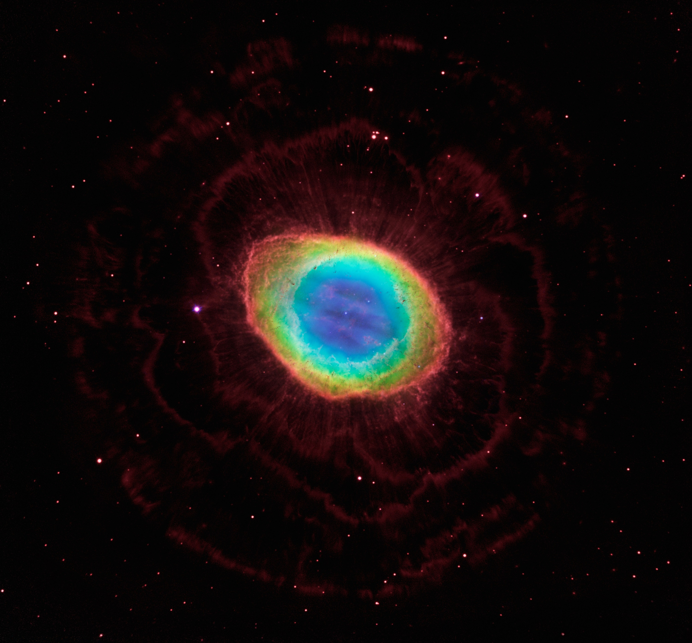

[![Contributors][contributors-shield]][contributors-url]
[![Forks][forks-shield]][forks-url]
[![Stargazers][stars-shield]][stars-url]
[![Issues][issues-shield]][issues-url]
[![Unlicense License][license-shield]][license-url]

 

  

  <h3 align="center">Vega Engine</h3>

  

    A C++ based graphics and scientific computation library !
     
    <a href="https://github.com/Poivre31/vega-engine"><strong>Explore the docs »</strong></a>
     
     
    <a href="https://github.com/Poivre31/vega-engine">View Demo</a>
    &middot;
    <a href="https://github.com/Poivre31/vega-engine/issues/new?labels=bug&template=bug-report---.md">Report Bug</a>
    &middot;
    <a href="https://github.com/Poivre31/vega-engine/issues/new?labels=enhancement&template=feature-request---.md">Request Feature</a>
  

<!-- TABLE OF CONTENTS -->

  
Table of Contents

  <ol>
    <li>
      <a href="#about-the-project">About The Project</a>
      <ul>
        <li><a href="#built-with">Built With</a></li>
      </ul>
    </li>
    <li>
      <a href="#getting-started">Getting Started</a>
      <ul>
        <li><a href="#prerequisites">Prerequisites</a></li>
        <li><a href="#installation">Installation</a></li>
      </ul>
    </li>
    <li><a href="#usage">Usage</a></li>
    <li><a href="#roadmap">Roadmap</a></li>
    <li><a href="#contributing">Contributing</a></li>
    <li><a href="#license">License</a></li>
    <li><a href="#contact">Contact</a></li>
    <li><a href="#acknowledgments">Acknowledgments</a></li>
  </ol>

<!-- ABOUT THE PROJECT -->
## About The Project

Started as a summer ray-tracing programming project after my freshman year in 2025, it is now growing into a more general purpose library aimed at making advanced scientific visualisation easy and performant !

### Built With

* [![ImGui-shield]][ImGui-url]

(<a href="#readme-top">back to top</a>)

<!-- GETTING STARTED -->
## Getting Started

Coming soon

### Prerequisites

Coming soon

### Installation

Coming soon

(<a href="#readme-top">back to top</a>)

<!-- USAGE EXAMPLES -->
## Usage

Coming soon

(<a href="#readme-top">back to top</a>)

<!-- ROADMAP -->
## Roadmap

- [ ] Reintroduce features from PBRT project
    - [ ] Math library
    - [ ] Utility
        - [ ] Main loop
        - [ ] Benchmarkin
    - [ ] Graphics library
        - [ ] GPU computing
        - [ ] 3D rendering and interface
        - [ ] Ray-tracer

     
- [ ] UI features
- [ ] Basic audio system
- [ ] Automated testing
- [ ] OS Support
    - [x] Windows
    - [ ] Linux
- [ ] Multi-language Support
    - [x] English
    - [ ] French

<!-- See the [open issues](https://github.com/Poivre31/vega-engine/issues) for a full list of proposed features (and known issues). -->

(<a href="#readme-top">back to top</a>)

<!-- CONTRIBUTING -->
## Contributing

Coming soon

<!-- If you have a suggestion that would make this better, please fork the repo and create a pull request. You can also simply open an issue with the tag "enhancement".
Don't forget to give the project a star! Thanks again!

1. Fork the Project
2. Create your Feature Branch (`git checkout -b feature/AmazingFeature`)
3. Commit your Changes (`git commit -m 'Add some AmazingFeature'`)
4. Push to the Branch (`git push origin feature/AmazingFeature`)
5. Open a Pull Request -->

### Top contributors:

(<a href="#readme-top">back to top</a>)

<!-- LICENSE -->
## License

Distributed under the GNU Affero General Public License. See `LICENSE.txt` for more information.

(<a href="#readme-top">back to top</a>)

<!-- CONTACT -->
## Contact

R Boisard - poivre.astro@gmail.com

Project Link: [https://github.com/Poivre31/vega-engine](https://github.com/Poivre31/vega-engine)

(<a href="#readme-top">back to top</a>)

<!-- ACKNOWLEDGMENTS -->
## Acknowledgments

Coming soon

<!-- * [Choose an Open Source License](https://choosealicense.com)
* [GitHub Emoji Cheat Sheet](https://www.webpagefx.com/tools/emoji-cheat-sheet)
* [Malven's Flexbox Cheatsheet](https://flexbox.malven.co/)
* [Malven's Grid Cheatsheet](https://grid.malven.co/)
* [Img Shields](https://shields.io)
* [GitHub Pages](https://pages.github.com)
* [Font Awesome](https://fontawesome.com)
* [React Icons](https://react-icons.github.io/react-icons/search) -->

(<a href="#readme-top">back to top</a>)

<!-- MARKDOWN LINKS & IMAGES -->
<!-- https://www.markdownguide.org/basic-syntax/#reference-style-links -->
[contributors-shield]: https://img.shields.io/github/contributors/Poivre31/vega-engine.svg?style=for-the-badge
[contributors-url]: https://github.com/Poivre31/vega-engine/graphs/contributors
[forks-shield]: https://img.shields.io/github/forks/Poivre31/vega-engine.svg?style=for-the-badge
[forks-url]: https://github.com/Poivre31/vega-engine/network/members
[stars-shield]: https://img.shields.io/github/stars/Poivre31/vega-engine.svg?style=for-the-badge
[stars-url]: https://github.com/Poivre31/vega-engine/stargazers
[issues-shield]: https://img.shields.io/github/issues/Poivre31/vega-engine.svg?style=for-the-badge
[issues-url]: https://github.com/Poivre31/vega-engine/issues
[license-shield]: https://img.shields.io/github/license/Poivre31/vega-engine.svg?style=for-the-badge
[license-url]: https://github.com/Poivre31/vega-engine/blob/master/LICENSE.txt

[ImGui-shield]: https://img.shields.io/badge/github-ImGui-blue?logo=github
[ImGui-url]: https://github.com/ocornut/imgui

