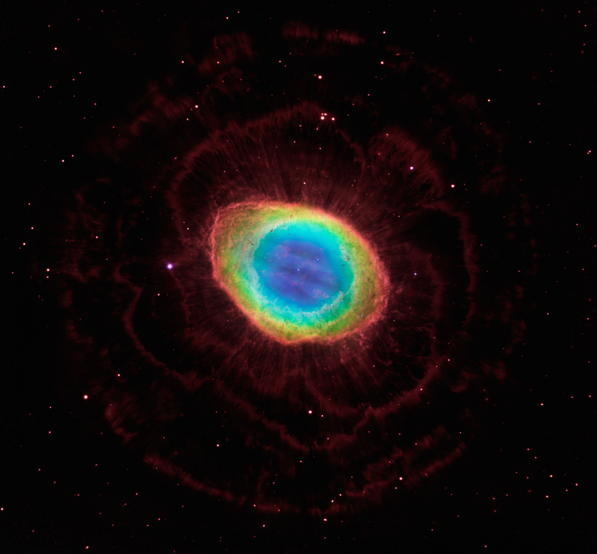
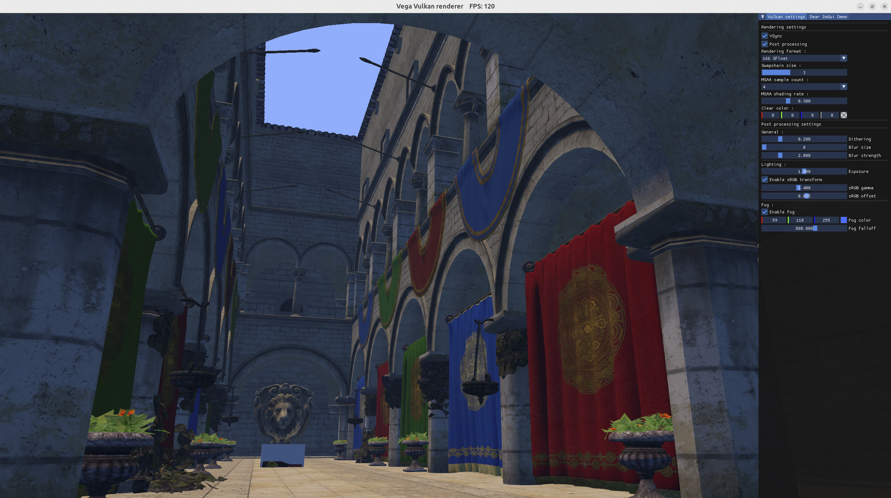

<a id="readme-top"></a>


[![Contributors][contributors-shield]][contributors-url]
[![Forks][forks-shield]][forks-url]
[![Stargazers][stars-shield]][stars-url]
[![Issues][issues-shield]][issues-url]
[![Unlicense License][license-shield]][license-url]


<br />
<div align="center">
  <a href="https://github.com/Poivre31/vega-engine">
    
  </a>

  <h3 align="center">Vega Engine</h3>

  <p align="center">
    A C++ based graphics and scientific computation library !
    <br />
    <a href="https://github.com/Poivre31/vega-engine"><strong>Explore the docs »</strong></a>
    <br />
    <br />
    <a href="https://github.com/Poivre31/vega-engine">View Demo</a>
    &middot;
    <a href="https://github.com/Poivre31/vega-engine/issues/new?labels=bug&template=bug-report---.md">Report Bug</a>
    &middot;
    <a href="https://github.com/Poivre31/vega-engine/issues/new?labels=enhancement&template=feature-request---.md">Request Feature</a>
  </p>
</div>


<!-- TABLE OF CONTENTS -->
<details>
  <summary>Table of Contents</summary>
  <ol>
    <li><a href="#about-the-project">About The Project</a></li>
    <li><a href="#getting-started">Getting Started</a></li>
    <li><a href="#usage">Usage</a></li>
    <li><a href="#samples">Usage</a></li>
    <li><a href="#roadmap">Roadmap</a></li>
    <li><a href="#contributing">Contributing</a></li>
    <li><a href="#license">License</a></li>
    <li><a href="#contact">Contact</a></li>
  </ol>
</details>


<!-- ABOUT THE PROJECT -->
## About The Project

Started as a summer ray-tracing programming project after my freshman year in 2025, it is now growing into a more general purpose library aimed at making advanced scientific visualisation easy and performant !

### Built With

* [![ImGui-shield]][ImGui-url]
* [![vulkan-shield]][vulkan-url]
* [![vma-shield]][vma-url]
* [![stb-shield]][stb-url]
* [![tinyobj-shield]][tinyobj-url]
* [![nanobench-shield]][nanobench-url]
* [![googletest-shield]][googletest-url]
* [![spdlog-shield]][spdlog-url]

<p align="right">(<a href="#readme-top">back to top</a>)</p>


<!-- GETTING STARTED -->
## Getting Started

### Using CMake
Add the vega-engine repository as a subdirectory, then link your project against "VegaEngine":

```
add_subdirectory(path-to-vega-engine)
target_link_libraries(YourTarget VegaEngine)
```


<p align="right">(<a href="#readme-top">back to top</a>)</p>


<!-- USAGE EXAMPLES -->
## Usage

`#include <application/application.hpp>` in one of your files. First define your application layers which will execute your code at specific steps. An application layer inherits from `ilayer` class and can be overloaded as such:

<details>
<summary> Example layers </summary>

```cpp
#include <application/application.hpp>
#include <console/console.hpp>

/* Layer needs to be final */
class layer1 final : public vega::ilayer {
 public:
  /* Needed for construction */
  using vega::ilayer::ilayer;

  /* Called right after application initialisation. Return false if layer initialisation failed s.t.
   * the application cannot continue execution. */
  bool init() noexcept final {
    _console->info("Creating Layer 1 !");
    return true;
  }

  /* Called after ImGui begin frame, used to manage UI */
  void gui_update() noexcept final {
    ImGui::Begin("Layer 1's settings");
    if (ImGui::Button("Press me")) {
      _counter++;
    }
    ImGui::Text("Button pressed %u times", _counter);
    ImGui::Checkbox("Enable logging", &_log);
    ImGui::End();
  }
  
  /* Called right before vulkan rendering, for each rendered frame */
  void update(double delta_time) noexcept final {
    if (_log) {
      _console->debug("Last frame's duration was {:.1f}ms", delta_time * 1000);
    }
  }

  /* Called every 'fixed_step', during fixed/physics frame update */
  void fixed_update(double fixed_step) noexcept final {
    if (_log) {
      _console->debug(
          "Physics step lasted {:.1f}ms, average frame delta time is {:.1f}ms",
          fixed_step * 1000,
          get_app_context()->avg_dt * 1000
      );
    }
  }

  /* Called on application destruction */
  void cleanup() noexcept final { _console->info("Destroying Layer 1 !"); }

 private:
  vega::vega_console _console = vega::console::create("Layer1");
  unsigned int _counter       = 0;
  bool _log                   = false;
};
```

***Note: you only need to overload the functions you actually use:***

```cpp
class layer2 final : public vega::ilayer {
 public:
  using vega::ilayer::ilayer;

  bool init() noexcept final {
    if (vega::random::uniform(0, 6) == 0) {
      return false;
    };
    vega::console::get()->info("Survived russian roulette !");
    return true;
  }

  /* Called at each physics frame, at a rate hard coded for now (60FPS) */
  void fixed_update(double fs) noexcept final {
    /* Code that can throw should be in a try block */
    try {
      size_t size = 10;
      if (vega::random::boolean(0.5)) {
        size = 1ULL << 63;
      }
      std::vector<float> vec(size);
      vega::console::get()->info("Created vector if size {}", vec.size());
    } catch (std::exception e) {
      vega::console::get()->error("Exception during 'layer 2' fixed update : {}", e.what());
    }
  }
};
```
</details>

You can then create and run your application like this:
```cpp
#include <application/application.hpp>
int main() { 
  
  /* You can disable logs under a certain level for the console in 'consoles' namespace. Default level is 'trace' for debug builds and 'info' otherwise.  */

  vega::console::set_library_consoles_log_level(vega::level::info);
  vega::application<layer1, layer2> app("Your app name");
  app.run();
}
```
***Note: all layer's functions (`init`, `update`...) are called in the order specified by the template `application<layer1, layer2>` except for `cleanup` which is called in reverse order.***

<p align="right">(<a href="#readme-top">back to top</a>)</p>


## Samples

### 3D renderer
Vega engine features a 3D realtime Vulkan render.


*Sponza scene renderer with vega's renderer*


<!-- ROADMAP -->
## Roadmap

- [ ] Math library (WIP)
- [ ] Utility
    - [x] Console
    - [x] Timer
    - [ ] Benchmarking (WIP)
- [ ] Graphics library
    - [ ] GPU computing
    - [x] 3D rendering and interface (WIP)
    - [ ] Ray-tracer
- [ ] Entity system
- [ ] UI features (WIP)
- [ ] Audio system
- [ ] Continous integration
- [x] OS Support
    - [x] Windows (MSVC, GCC)
    - [x] Linux (GCC, Clang)
- [ ] Multi-language Support
    - [x] English
    - [ ] French

<!-- See the [open issues](https://github.com/Poivre31/vega-engine/issues) for a full list of proposed features (and known issues). -->

<p align="right">(<a href="#readme-top">back to top</a>)</p>


<!-- CONTRIBUTING -->
## Contributing

If you have a suggestion that would make this better, please fork the repo and create a pull request. You can also simply open an issue with the tag "enhancement".
Don't forget to give the project a star! Thanks again!

1. Fork the Project
2. Create your Feature Branch (`git checkout -b feature/AmazingFeature`)
3. Commit your Changes (`git commit -m 'Add some AmazingFeature'`)
4. Push to the Branch (`git push origin feature/AmazingFeature`)
5. Open a Pull Request

### Top contributors:

<a href="https://github.com/Poivre31/vega-engine/graphs/contributors">
  
</a>

<p align="right">(<a href="#readme-top">back to top</a>)</p>


<!-- LICENSE -->
## License

Distributed under the GNU Affero General Public License. See `LICENSE.txt` for more information.

<p align="right">(<a href="#readme-top">back to top</a>)</p>


<!-- CONTACT -->
## Contact

R Boisard - poivre.astro@gmail.com

Project Link: [https://github.com/Poivre31/vega-engine](https://github.com/Poivre31/vega-engine)

<p align="right">(<a href="#readme-top">back to top</a>)</p>


<!-- ACKNOWLEDGMENTS 
## Acknowledgments

Coming soon

* [Choose an Open Source License](https://choosealicense.com)
* [GitHub Emoji Cheat Sheet](https://www.webpagefx.com/tools/emoji-cheat-sheet)
* [Malven's Flexbox Cheatsheet](https://flexbox.malven.co/)
* [Malven's Grid Cheatsheet](https://grid.malven.co/)
* [Img Shields](https://shields.io)
* [GitHub Pages](https://pages.github.com)
* [Font Awesome](https://fontawesome.com)
* [React Icons](https://react-icons.github.io/react-icons/search)

<p align="right">(<a href="#readme-top">back to top</a>)</p> -->


<!-- MARKDOWN LINKS & IMAGES -->
<!-- https://www.markdownguide.org/basic-syntax/#reference-style-links -->
[contributors-shield]: https://img.shields.io/github/contributors/Poivre31/vega-engine.svg?style=for-the-badge
[contributors-url]: https://github.com/Poivre31/vega-engine/graphs/contributors
[forks-shield]: https://img.shields.io/github/forks/Poivre31/vega-engine.svg?style=for-the-badge
[forks-url]: https://github.com/Poivre31/vega-engine/network/members
[stars-shield]: https://img.shields.io/github/stars/Poivre31/vega-engine.svg?style=for-the-badge
[stars-url]: https://github.com/Poivre31/vega-engine/stargazers
[issues-shield]: https://img.shields.io/github/issues/Poivre31/vega-engine.svg?style=for-the-badge
[issues-url]: https://github.com/Poivre31/vega-engine/issues
[license-shield]: https://img.shields.io/github/license/Poivre31/vega-engine.svg?style=for-the-badge
[license-url]: https://github.com/Poivre31/vega-engine/blob/master/LICENSE.txt

[ImGui-shield]: https://img.shields.io/badge/github-ImGui-blue?logo=github
[ImGui-url]: https://github.com/ocornut/imgui

[vulkan-shield]: https://img.shields.io/badge/github-Vulkan_HPP-blue?logo=github
[vulkan-url]: https://github.com/KhronosGroup/Vulkan-Hpp

[vma-shield]: https://img.shields.io/badge/github-VMA_HPP-blue?logo=github
[vma-url]: https://github.com/YaaZ/VulkanMemoryAllocator-Hpp

[stb-shield]: https://img.shields.io/badge/github-stb_image-blue?logo=github
[stb-url]: https://github.com/nothings/stb

[tinyobj-shield]: https://img.shields.io/badge/github-tiny_obj_loader-blue?logo=github
[tinyobj-url]: https://github.com/tinyobjloader/tinyobjloader

[nanobench-shield]: https://img.shields.io/badge/github-nanobench-blue?logo=github
[nanobench-url]: https://github.com/martinus/nanobench

[googletest-shield]: https://img.shields.io/badge/github-GoogleTest-blue?logo=github
[googletest-url]: https://github.com/google/googletest

[spdlog-shield]: https://img.shields.io/badge/github-spdlog-blue?logo=github
[spdlog-url]: https://https://github.com/gabime/spdlog